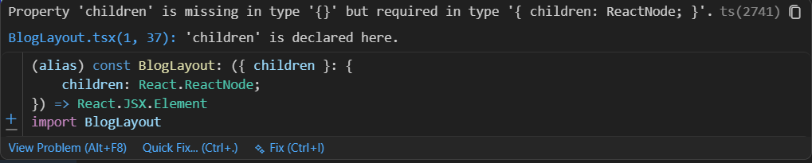

# Day 04


Date: 20-06-2026

## Goal

Build Blog page,

## Concepts Learned

First I desigen the wire frame mentioned below


I designe this wireframe with a help of Claude.ai
(Because I don't know do to design)

## Problems Faced

Problem: 

1. when we come to Blog its layout is totally different from our normal layout. so we need to code another layout 

Reason:

because the blog feature is designed to the user should focus on Articles, and avoid distractions.

Solutions:

I update the AppRoutes like below code 

```TS

import { Routes, Route } from "react-router-dom";
import MainLayout from "../components/layout/MainLayout";
import BlogLayout from "../components/layout/BlogLayout";  // ← add this

import Overview from "../pages/Overview/Overview";
import Projects from "../pages/Projects/Projects";
import Learning from "../pages/Learning/Learning";
import Notes from "../pages/Notes/Notes";
import Roadmaps from "../pages/Roadmaps/Roadmaps";
import Achievements from "../pages/Achievements/Achievements";
import Blog from "../pages/Blog/Blog";
import Resources from "../pages/Resources/Resources";

const AppRoutes = () => {
  return (
    <Routes>

      {/* GROUP 1: MainLayout — Navbar + Sidebar */}
      <Route path="/" element={<MainLayout />}>
        <Route index element={<Overview />} />
        <Route path="projects" element={<Projects />} />
        <Route path="learning" element={<Learning />} />
        <Route path="notes" element={<Notes />} />
        <Route path="roadmaps" element={<Roadmaps />} />
        <Route path="achievements" element={<Achievements />} />
        <Route path="resources" element={<Resources />} />
      </Route>

      {/* GROUP 2: BlogLayout — Navbar only, no Sidebar */}
      <Route path="/blog" element={<BlogLayout />}>
        <Route index element={<Blog />} />
        <Route path=":id" element={<BlogDetail />} />  {/* for later */}
      </Route>

    </Routes>
  );
};

export default AppRoutes;

```



## What Changed vs Your Current Code

| Before | After |
| --- | --- |
| `blog` was a child of `MainLayout` | `blog` has its own parent `BlogLayout` |
| All routes shared one layout | Two layout groups, separate |
| Sidebar showed on Blog page | Sidebar hidden on Blog routes |